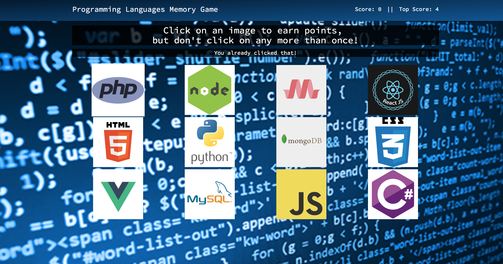
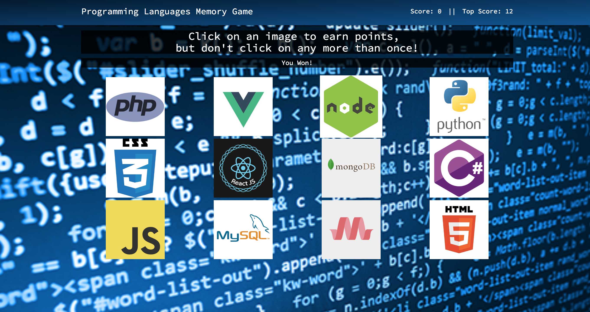

### Web Development Themed Memory Game

* Memory game where the user clicks on logos for programing languages and frameworks.
* Each image the user clicks gets them a point, but they lose when they click the same logo twice.

### Getting Started
* Make sure you have the latest version of yarn installed.
* The app can be run by cloning this repo to your machine and running "yarn start"

### Built With
* [React](https://reactjs.org/)
* [Materialize](http://materializecss.com/)

### Author
* Jason Schultz - [JasonGoesPlaces](https://github.com/jasongoesplaces)

### Screenshots

Game Reset

Game Loss

Game Win

